### Hi there 👋

- 🔭 I’m currently working for `Golang`.
- 🌱 I’m currently learning `algorithm`, `distributed system`, `micro service`.
- 💬 Ask me about anything: [@Email to coder2z](mailto:myxy99@foxmail.com).
- 📫 How to reach me: [@Telegram to Coder_Y](https://t.me/Coder_Y).
- 😄 Pronouns: Yangon / 阿水 .

### My GitHub Contributions 🏷

<a href="https://github.com/coder2z?tab=repositories">
<table cellspacing="0" cellpadding="0">
<tr>
<td valign="top" width="50%">

</td>
<td valign="top" width="50%">

</td>
</tr>
</table>
</a>
